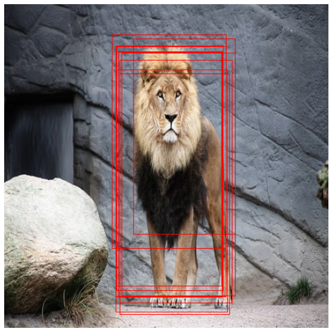

# Region Proposal Network

Tensorflow 2.5.0 implementation of Region Proposal Network, a minimal object localization framework inspired by [Faster R-CNN: Towards Real-Time Object
Detection with Region Proposal Networks](https://arxiv.org/pdf/1506.01497.pdf).

## Usage

```
python train.py [OPTIONS]

Options:
  --wandb_project_name TEXT     Wandb Project Name
  --wandb_experiment_name TEXT  Wandb Experiment Name
  --wandb_entity TEXT           Wandb Logger Entity
  --wandb_api_key TEXT          Wandb API
  --feature_map_shape INTEGER   Shape of the output feature map
  --use_voc_2012                Include VOC 2012 Dataset in Training
  --batch_size INTEGER          Batch Size
  --backbone TEXT               Specify the Backbone [vgg16, vgg19 or
                                mobilenet_v2]

  --learning_rate FLOAT         Learning Rate
  --epochs INTEGER              Number of Training Epochs
  --help                        Show this message and exit.
```

```
infer.py [OPTIONS]

Options:
  --feature_map_shape INTEGER  Shape of the output feature map
  --backbone TEXT              Specify the Backbone [vgg16, vgg19 or
                               mobilenet_v2]

  --model_file TEXT            Path of pre-trained model file
  --image_file TEXT            Path of the image to be inferred
  --help                       Show this message and exit.
```

## Demo




